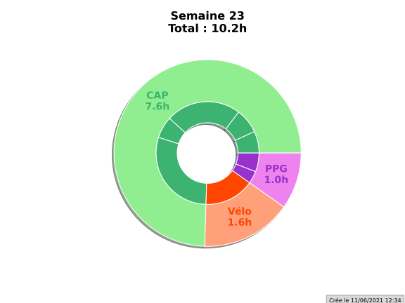

# strava_analyse_data

This simple project is made to help you improve

your shape every week by analysing your trainings.

### How to use ?

WARNING : The strava account that is logged is still my account

Just execute pye.py
